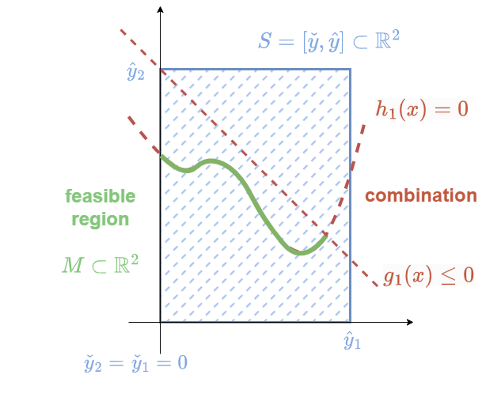

 

 
<h2>Tutorial:</h2>
<h1>Introduction to Evolution Strategies for  Constrained Optimization Problems </h1>
   

Michael Hellwig, Steffen Finck, and Hans-Georg Beyer

 

Josef Ressel Centre for Robust Decision Making, Vorarlberg University of Applied Sciences, Dornbirn, Austria.

 

The financial support by the Austrian Federal Ministry of Labour and Economy, the National Foundation for Research, Technology and Development and by the Christian Doppler Research Association is gratefully acknowledged. 

 
 
 

Please find the experimentation sources in the `main` branch of this repository. 
 

Go to: [https://github.com/jrc-rodec/es4cop](https://github.com/jrc-rodec/es4cop)
 

Have fun!  

